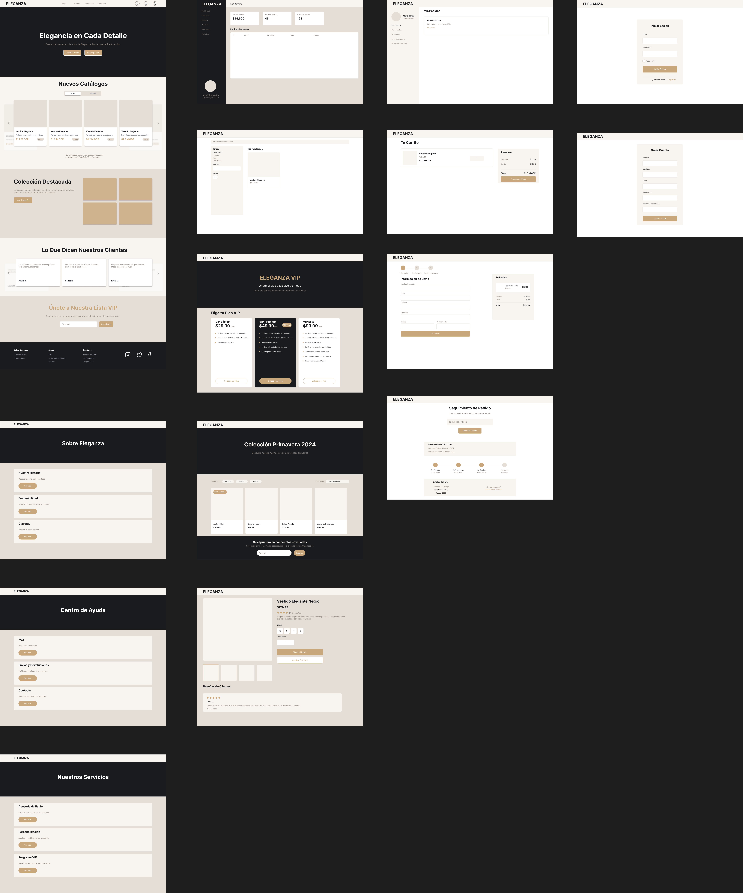

# ELEGANZA - Plataforma E-commerce de Moda

## 📋 Descripción

ELEGANZA es una plataforma e-commerce especializada en moda que busca satisfacer las necesidades de los clientes en cuanto a la compra de ropa y accesorios. El sistema está diseñado para ofrecer una experiencia de usuario fluida , conectando a compradores con las últimas tendencias de moda.

## 🖼️ Mockup de la pagina web ELEGANZA.



### 🎯 Características Principales

- **Catálogo Dinámico**: Exploración intuitiva de productos con filtros y categorización _(pending)_
- **Sistema de Recomendaciones**: Sugerencias basadas en temporadas y categorias _(pending)_
- **Carrito de Compras**: Gestión eficiente del proceso de compra con múltiples opciones de pago _(pending)_
- **Panel de Administración**: Control total sobre productos, inventario, pedidos y usuarios _(pending)_
- **Gestión de Usuarios**: Perfiles personalizados con historial de compras y preferencias _(pending)_
- **Sistema de Valoraciones**: Reseñas y calificaciones de productos verificadas _(pending)_

### 🛠️ Tecnologías Utilizadas

- Frontend: HTML, CSS, JavaScript
- Backend: Python, Flask
- Base de Datos: MySQL
- Servicios Cloud: AWS _(Pending)_

## 🚀 Estado del Proyecto

**El proyecto se encuentra actualmente en fase de desarrollo**

## 📦 Instalación

### Scripts de instalación y ejecución para el proyecto eleganza en Flask

Este repositorio contiene tres scripts shell para gestionar el ciclo de vida de la pagina web ELEGANZA en Flask con una base de datos en MySQL80.

#### Descripción de los Scripts

#### 1. `ini_cero.sh`
Este script realiza la configuración inicial completa del proyecto:

```bash 
python -m venv venv # Crea un nuevo entorno virtual
pip install -r requirements.txt # Instala todas las dependencias
source venv/Scripts/activate # Activa el entorno virtual
net start MySQL80 # Inicia el servidor MySQL
python run.py # Ejecuta la aplicación Flask
```

#### 2. `ini_flask.sh`
Este script inicia el servidor Flask:   
```bash
source venv/Scripts/activate # Activa el entorno virtual
net start MySQL80 # Inicia el servidor MySQL
python run.py # Ejecuta la aplicación Flask
```

#### 3. `stop_flask.sh`
Este script detiene el servidor Flask:

```bash
net stop MySQL80 # Detiene el servidor MySQL
deactivate # Desactiva el entorno virtual
```

#### Notas: 
> [!IMPORTANT]
> - Asegúrate de que el archivo `requirements.txt` existe y contiene todas las dependencias necesarias
> - Los scripts deben tener permisos de ejecución
> - El servicio MySQL debe llamarse "MySQL80" en tu sistema
> - El entorno virtual se creará en una carpeta llamada "venv"

> [!WARNING]
> - Este repositorio está configurado para ejecutarse en un entorno Windows. Si estás utilizando un entorno Linux, es posible que necesites ajustar los comandos de activación del entorno virtual y la gestión del servidor MySQL. 

## 👥 Equipo

- ```@Curcolor```
- ```@DANN-MAGE```

## 📄 Licencia

Este proyecto está bajo la Licencia MIT - ver el archivo LICENSE.md para más detalles.

## 📞 Contacto

Para más información sobre el proyecto, puede contactar a ```@Curcolor``` o ```@DANN-MAGE```.